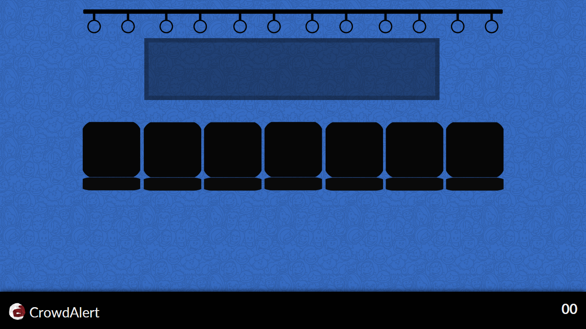
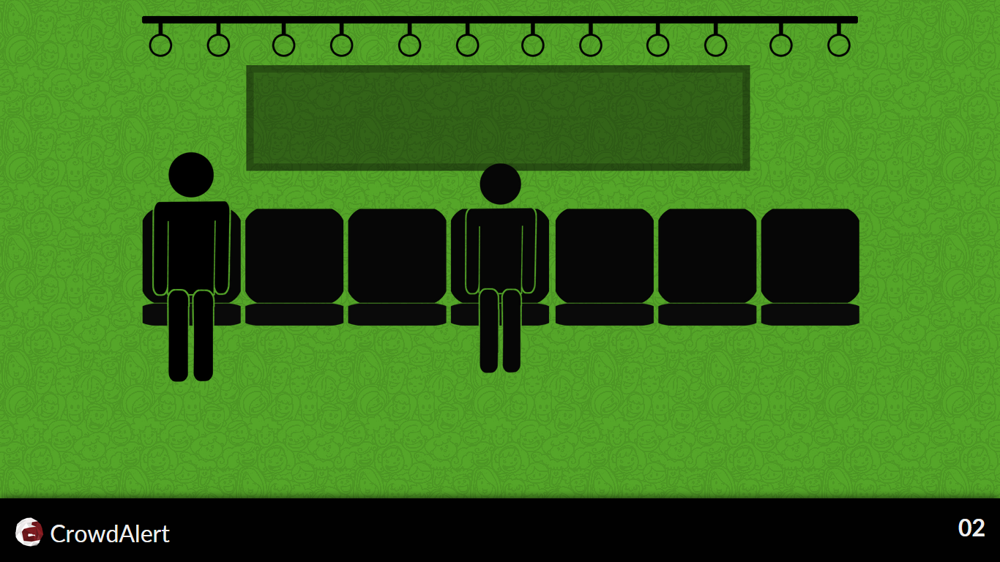
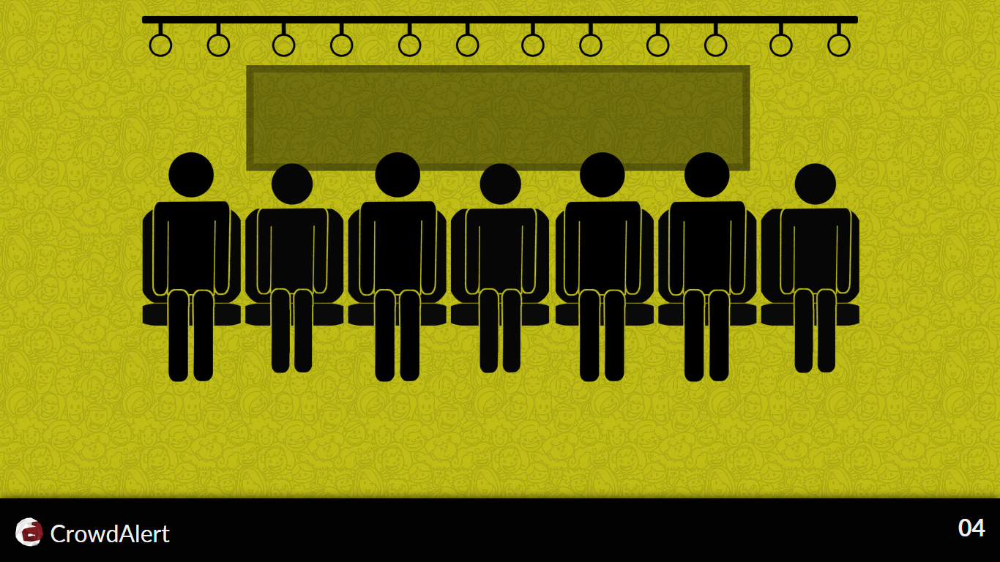
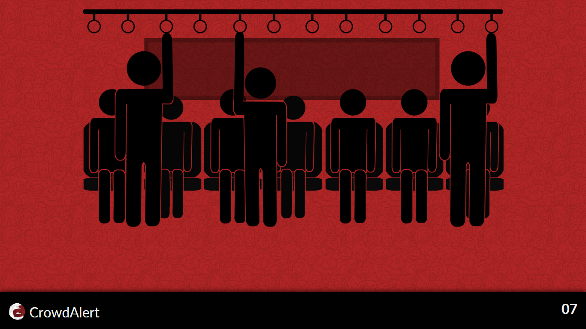

# Crowd Alert
Crowd Alert is a population density management system in public places such as metros and busses. The system shows the current number of people in particular coach and/or bus, and also shows when it is arriving at a station and from where you should board so that you face minimum hassle and crowd with maximum convenience.

## Applications

The potential for this technology is endless, this can be implemented anywhere with a problem of crowd. If any kind of system is currently available with IDs or tokens, this can be implemented for even cheaper. This can be used in places like Metros, Bus Stations, Movie Halls, Concerts, Stadiums, Colleges, Offices and whatnot. Crowd Management and tracking becomes very easy when this tech in deployed. This is also capable of generation density heatmaps for appropriate places.

## Features
### Crowd Density Display

The crowd density can be seen either on the screens installed in the metro/bus stations or using our app on your mobile phone. The app displays the density is the simplest way possible. Red for over crowded, yellow for almost full, green for lightly occupied, and blue for empty along with the number of people inside the coach/bus. This way, you always know the best coach to broad with maximum convenience.

### Recharge for card

For public places like Metro and Bus Stations, the functionality to reload the prepaid card for hassle-free travel is available right inside the app. You mobile will be able to scan a nearby card and you'll be able to load balance on your travel card by paying through your favourite method. We have integrated the CoinSecure API to pay via Bitcoin for your card recharges for paying fares for Metro or any public transport.

### Buddies

The app comes with an ability to register friends inside the app using their cards or IDs. Once you register your friends inside the app, the app will let you know if any of your buddies are around you, so that you can meet or talk to them if you want to. This also serves added functionality in places like conference rooms, you can easily know where your team mates/boss is, or if a room is actually empty so as to enter and start your team meeting.

## Demo

*Crowd Alert - Empty Coach*

*Crowd Alert - Mildly Occupied Coach*

*Crowd Alert - Semi Occupied Coach*

*Crowd Alert - Over Crowded Coach*

Additional Videos are available in `demo-content` directory.

## Crowd Alert Team
Nothing works without a team, afterall.

### Akshat Mittal ( [@akshatmittal](http://github.com/akshatmittal) )
	Frontend, Backend, Android App - View Client

### Akshay Dadwal ( [@aksdad](http://github.com/aksdad) )
	Backend, Database

### Raghav Apoorv ( [@roalts](http://github.com/roalts) )
	Android App - Main Client

### Shikhar Sahdev
	Frontend Design, App Design and Identity

## Apps & Directories

### Android App - Client

The Android app provides access for the users to the recharge system, density display and buddies. Built on Android Studio and Visual Studio 2015. Contained in `crowdalert-androidalient-main` and `crowdalert-androidclient-view` directories.

### Android App - Server

The server Android app is built using Android Studio. This is basically what senses the people. This will be deployed on a Chip or Raspberry Pi in reality. Built on Android Studio.

### Website

The website provides access to the crown density. Built using PHP, HTML, JS and CSS. Contained in `crowdalert-web` directory.

The demo content is stored in `demo-content` directory which includes images and video for demo.